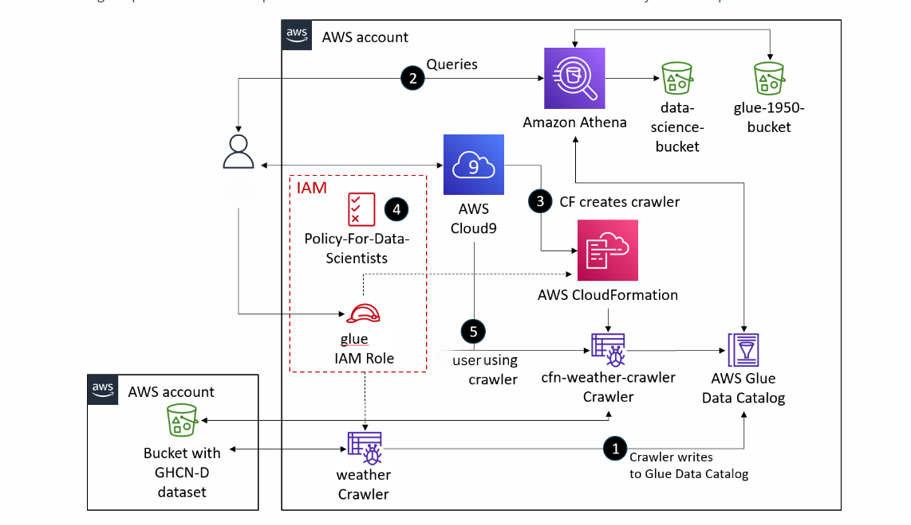
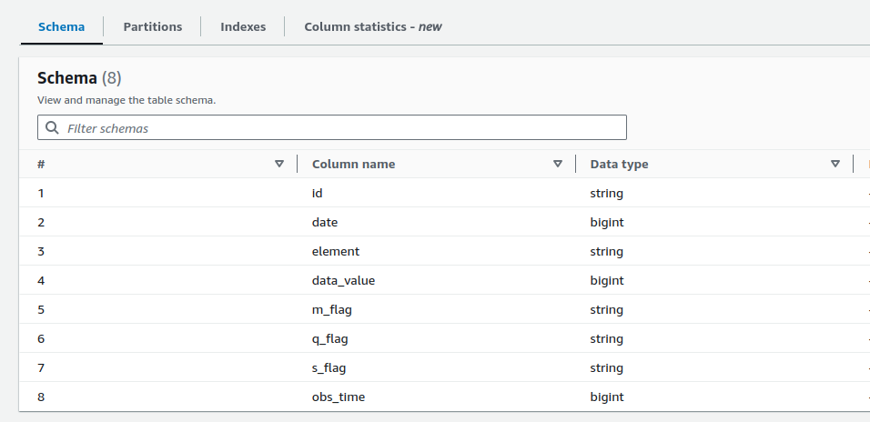
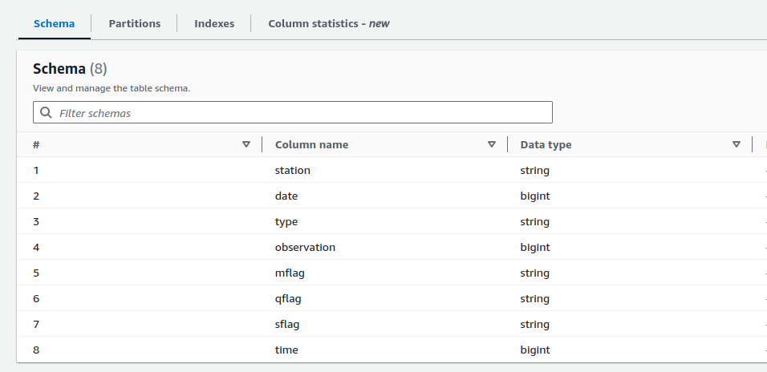
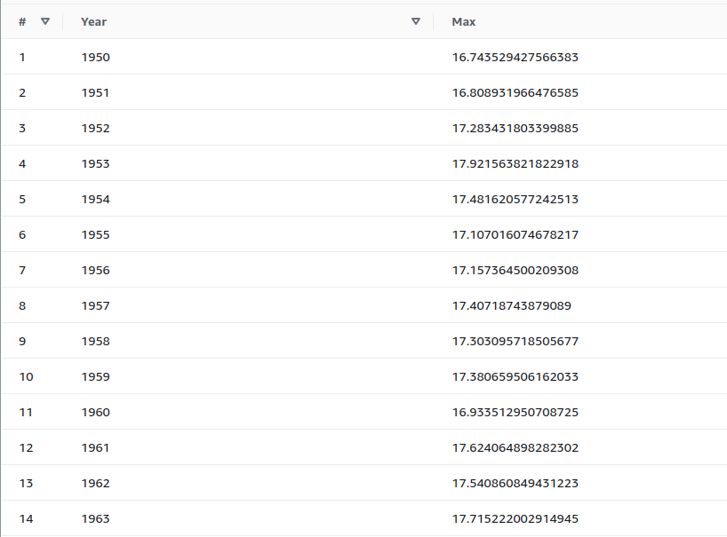

# Aws-pipeline
# What it the aim of this project?
You have a dataset, you want to automatically to infer the columns and data (the schema) and you want to automate this to also the other users(departement) while adding some transformations=> This is what this project do mianly


## Architecture



### Why We Use Certain Services

- **AWS Glue**: Direct AWS Glue to data stored on AWS, and the service will discover your data. Create AWS Glue crawlers to run on demand or on a set schedule. Run the crawler to build the database and generate the metadata.
- **Amazon Athena**: An interactive query service that makes it simple to analyze data directly in Amazon S3 using standard SQL.
- **Apache Parquet**: An open-source columnar data format optimized for performance and storage.

## Data Used

[Global Historical Climatology Network Daily (GHCN-D) Dataset](https://docs.opendata.aws/noaa-ghcn-pds/readme.html)

## Steps

1. **Access AWS Glue** in the AWS Management Console and create a crawler.
2. **Create an AWS Glue database** with tables and a schema using a crawler.
3. **Query data** in the AWS Glue database using Athena.
4. **Create and deploy an AWS Glue crawler** using an AWS CloudFormation template.
5. **Review an AWS Identity and Access Management (IAM) policy** for users to run an AWS Glue crawler and query an AWS Glue database in Athena.
6. **Confirm that a user with the IAM policy** can use the AWS Command Line Interface (AWS CLI) to access the AWS Glue database created by the crawler.
7. **Confirm that a user can run the AWS Glue crawler** when source data changes.

### Task 1: Using an AWS Glue Crawler with the GHCN-D Dataset

- Configure and create an AWS Glue crawler.
- Run the crawler to extract, transform, and load data into an AWS Glue database.
- Review the metadata of a table created by the crawler.
- Edit the schema of the table.

As shown below, we successfully configured the crawler to get the data's metadata:



After modifying the schema (renaming columns):



### Task 2: Querying a Table Using Athena

- Configure an S3 bucket to store Athena query results.
- Preview a database table in Athena.
- Create a table for data after 1950.
- Run a query on selected data.

Refer to the `Transformations.sql` file in the `SQLqueries` directory for the different queries used to achieve this output:



### Task 3: Creating a CloudFormation Template for an AWS Glue Crawler

- Reuse crawlers across environments, especially when new data is added to the datasets.
- Use the AWS CLI to run the crawler.
- Create and deploy a crawler using CloudFormation.

First, create a new CloudFormation template as shown in the `gluecrawler.cf.yml` file.

Validate the template:

```bash
aws cloudformation validate-template --template-body file://gluecrawler.cf.yml
```

Create the CloudFormation stack (this implements the template):

```bash
aws cloudformation create-stack --stack-name gluecrawler --template-body file://gluecrawler.cf.yml --capabilities CAPABILITY_NAMED_IAM
```

### Task 5: Confirming Another User Can Access and Use the AWS Glue Crawler

- Test the user's ability to use the crawler to extract, transform, and load data from a dataset stored in Amazon S3 into an AWS Glue database.
- To test whether the user can perform a specific command, pass the user's credentials as bash variables (AK and SAK) obtained from the CloudFormation stack's output with the command. The API will then try to perform that command as the specified user.

The command to run the crawlers:

```bash
AWS_ACCESS_KEY_ID=$AK AWS_SECRET_ACCESS_KEY=$SAK aws glue start-crawler --name cfn-crawler-weather
```

For my user, they can run the crawler because I gave them these permissions in the IAM policy (the output of the command is a long YAML stating that the crawler is starting).

## Tips

- To optimize your use of Athena, store data in the Apache Parquet format.
- By reducing your query to only three columns of temperature data from 1950 through 2015, you reduce your costs for storage. Also, because the query data is arranged in a columnar format with Apache Parquet, the time taken to perform the queries is reduced, resulting in lower costs as fewer computational resources are used in Athena.
